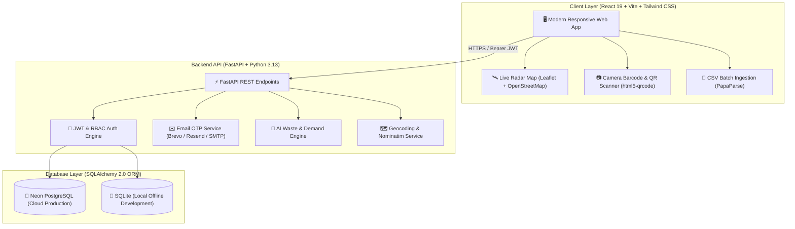
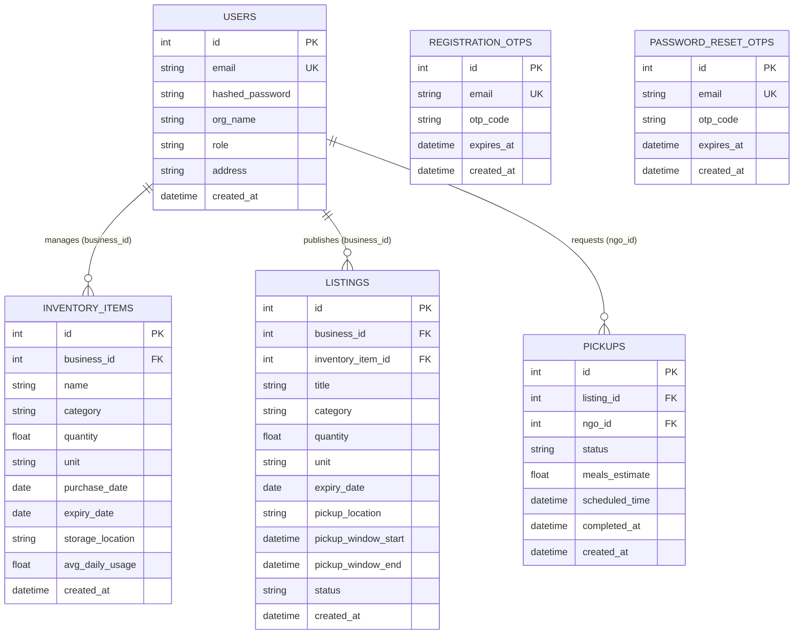

# Harvest Ledger — AI-Powered Food Waste Management & Redistribution Platform

[](https://github.com/preygoti/foodwaste-platform)
[](https://fastapi.tiangolo.com/)
[](https://python.org/)
[%20%2F%20SQLite-4169E1?style=flat-square&logo=postgresql)](https://www.postgresql.org/)
[](https://react.dev/)
[](https://leafletjs.com/)
[](https://tailwindcss.com/)
[](https://github.com/preygoti/foodwaste-platform)

> **Harvest Ledger** is an intelligent full-stack ecosystem connecting food businesses (supermarkets, restaurants, bakeries, food distributors) with non-profits (NGOs, food banks, community kitchens) to eliminate edible food waste, track batch-level shelf life with predictive AI, and execute verifiable digital QR handshakes for food redistribution.

---

## 📊 Comprehensive Milestone Roadmap & Status

| Phase | Milestone | Focus Area | Status | Key Deliverables |
|---|---|---|---|---|
| **Phase 1** | **Milestone 1** | **System Architecture, Database & Ingestion** | **`COMPLETED` ✅** | • Relational Neon PostgreSQL & SQLite database<br/>• Dual-role JWT authentication (Business & NGO)<br/>• 6-digit Email OTP registration verification<br/>• Multi-modal inventory logging (Form + Barcode Camera + CSV) |
| **Phase 2** | **Milestone 2** | **AI Waste Prediction Engine & Shelf Life** | **`COMPLETED` ✅** | • 0–100 heuristic waste risk scoring algorithm<br/>• Predictive stock reorder recommendations (`Reorder +X`)<br/>• AI Computer Vision Freshness & Spoilage Scanner<br/>• Real-time reactive expiry countdown tickers |
| **Phase 3** | **Milestone 3** | **Redistribution Marketplace & Live Radar** | **`COMPLETED` ✅** | • Real-time NGO redistribution marketplace<br/>• Live Radar Map with GPS auto-locate & OpenStreetMap<br/>• Smart address geocoding (100+ cities + Nominatim API)<br/>• Multi-stop turn-by-turn route planner & Google Maps link |
| **Phase 4** | **Milestone 4** | **Digital QR Handshake & ESG Telemetry** | **`COMPLETED` ✅** | • Competitive multi-NGO request & donor acceptance flow<br/>• Secure QR Driver Rescue Pass & camera handshake scanner<br/>• Official ESG Tax Statement & audit generator<br/>• Real-time cross-device auto-polling synchronization |

---

## 🎯 Core Platform Capabilities

### 1. ✉️ Mandatory 6-Digit Email OTP Verification (Registration & Password Reset)
- **Account Verification**: Every new business and NGO account must verify their email with a 6-digit OTP code before account creation.
- **Provider Support**: Built-in support for **Brevo (Sendinblue)** (300 emails/day free for life), **Resend**, **SendGrid**, standard **SMTP / Gmail App Password**, and local console mode.
- **Security**: 10-minute expiry window, 60-second client-side cooldown timer, and brute-force prevention.

### 2. 📦 Multi-Modal Inventory Management
- **Manual Form Entry**: Quick batch logging with units (`kg`, `liters`, `units`, `portions`, `boxes`), expiry dates, and storage locations.
- **📷 Device Camera Barcode/QR Scanner**: Real-time barcode scanning using `html5-qrcode` with instant product metadata lookup.
- **📄 Bulk CSV Ingestion**: High-speed batch processing via `PapaParse` with schema validation and error reporting.
- **🤖 AI Vision Freshness Scanner**: Interactive simulated/live image quality grading and shelf-life prediction.

### 3. 🧠 Predictive Waste & Demand Engine
- **Risk Scoring (0–100)**: Evaluates days-to-expiry against daily consumption velocity to classify items into `Low`, `Medium`, and `High` waste risk.
- **Reorder Recommendations (`Reorder +X`)**: Calculates optimal 7-day restocking buffer without causing overstock waste.
- **Rescue Chef Modal**: Suggests creative zero-waste recipes for near-expiry ingredients.

### 4. 🛰️ Live Radar Map & Smart Geolocation
- **100% Free OpenStreetMap Tiles**: High-performance mapping via `Leaflet` with zero API key dependencies and zero rate limits.
- **Live GPS Tracking**: Automatically pinpoints driver/NGO location via `navigator.geolocation` with `[🎯 My GPS]` and `[🔄 Fit All]` controls.
- **Geocoding Pipeline**: Offline dictionary for 100+ Indian & global metro areas combined with asynchronous OpenStreetMap Nominatim geocoding.
- **Turn-by-Turn Navigation**: Real Haversine distance badges (e.g. `📍 1.2 km away`) and direct Google Maps driving directions.

### 5. 🤝 Digital Rescue Handshake (QR Verification)
- **Multi-NGO Bidding**: Multiple non-profits can request available surplus donations simultaneously.
- **Donor Selection**: Donor selects the recipient NGO; rejected requests are automatically notified and closed.
- **QR Driver Pass**: Assigned NGO receives a cryptographically linked Digital Rescue Pass (`HL-RES-XXXX`).
- **Storefront Verification**: Donor scans the driver's QR code at pickup to instantly verify handoff, transfer chain of custody, and record ESG metrics.

### 6. 📄 Official ESG Tax & Audit Reporting
- Computes fair-market tax relief deductions, landfill disposal fees saved, and net environmental impact.
- One-click print-ready ESG Tax Deduction and Audit Statement.

---

## 🏗️ System Architecture



---

## 🗄️ Relational Data Model



---

## 🛠️ Technology Stack

| Layer | Technology | Key Capabilities |
|---|---|---|
| **Frontend** | **React 19**, **Vite 8**, **Tailwind CSS 3.4** | Fast SPA, responsive glassmorphism UI, hidden scrollbars |
| **Mapping & Radar** | **Leaflet 1.9**, **OpenStreetMap Standard** | GPS auto-locate, smart geocoding, radius filter, Google Maps routing |
| **Camera & Barcode** | **html5-qrcode** | Real-time camera QR and barcode scanning |
| **CSV Engine** | **PapaParse 5.6** | High-performance bulk client-side spreadsheet parsing |
| **Backend API** | **FastAPI 0.115**, **Python 3.13**, **Uvicorn** | Asynchronous RESTful APIs with automatic OpenAPI/Swagger docs |
| **Database & ORM** | **PostgreSQL (Neon)**, **SQLite**, **SQLAlchemy 2.0** | Relational data persistence with pooling and migrations |
| **Email Service** | **Brevo HTTPS API**, **Resend**, **SendGrid**, **SMTP** | Transactional 6-digit OTP delivery with lifetime free tiers |
| **Security & Auth** | **Python-JOSE**, **Passlib (Bcrypt)** | Stateless JWT tokens, role guards (RBAC), salted password hashes |

---

## 📂 Project Directory Structure

```text
foodwaste-platform/
├── backend/
│   ├── auth.py                  # JWT creation, Bcrypt hashing, role dependencies
│   ├── database.py              # SQLAlchemy engine & PostgreSQL URL normalization
│   ├── email_service.py         # Brevo/Resend/SendGrid/SMTP 6-digit OTP dispatch
│   ├── main.py                  # FastAPI application & REST endpoint routers
│   ├── models.py                # Database models (User, Inventory, Listing, Pickup, OTPs)
│   ├── requirements.txt         # Python dependencies
│   ├── risk_engine.py           # AI heuristic risk scoring & reorder buffer math
│   ├── schemas.py               # Pydantic validation schemas
│   └── test_platform_full.py    # 11-step automated unit & integration test suite
│
├── frontend/
│   ├── src/
│   │   ├── components/          # UI Modals & Widgets
│   │   │   ├── AiVisionScannerModal.jsx  # AI Freshness Scanner
│   │   │   ├── BarcodeScannerModal.jsx   # Live Camera Barcode Scanner
│   │   │   ├── CsrCertificateModal.jsx   # Sustainability CSR Certificate
│   │   │   ├── CsvUploadModal.jsx        # Bulk CSV Ingestion
│   │   │   ├── EsgTaxReportModal.jsx     # ESG Tax Statement Modal
│   │   │   ├── Layout.jsx                # Global navigation shell
│   │   │   ├── PickupQrModal.jsx         # Driver Rescue Pass QR Generator
│   │   │   ├── RescueChefModal.jsx       # Zero-Waste Recipe Generator
│   │   │   ├── RescueMap.jsx             # Live Radar Map (Leaflet + OSM)
│   │   │   └── VerifyQrModal.jsx         # Storefront Handshake Scanner
│   │   ├── pages/               # Application Views
│   │   │   ├── AnalyticsPage.jsx         # ESG Impact & Financial Telemetry
│   │   │   ├── BrowseListingsPage.jsx    # NGO Surplus Marketplace & Radar
│   │   │   ├── BusinessListingsPage.jsx  # Donor Active Listings & Pickups
│   │   │   ├── ForgotPassword.jsx        # Password Reset OTP Flow
│   │   │   ├── InventoryPage.jsx         # Business Inventory Ledger
│   │   │   ├── Landing.jsx               # Public Landing Page
│   │   │   ├── Login.jsx                 # User Authentication
│   │   │   ├── MyPickupsPage.jsx         # NGO Rescue Operations Ledger
│   │   │   └── Register.jsx              # User Registration with Email OTP
│   │   ├── utils/
│   │   │   └── geocoding.js              # Offline dictionary & Nominatim geocoder
│   │   ├── api.js               # Centralized Axios/Fetch API client
│   │   ├── App.jsx              # Application Route Map
│   │   ├── AuthContext.jsx      # Global Auth & Role State Provider
│   │   └── index.css            # Tailwind & Global Styling
│   ├── package.json             # Frontend dependencies & npm scripts
│   ├── tailwind.config.js       # Design tokens & color palette
│   └── vite.config.js           # Vite configuration
│
└── README.md                    # Project Documentation
```

---

## 🚀 Quick Start Guide

### Prerequisites
- **Node.js** (v18+) & **npm**
- **Python** (v3.10+)

---

### 1. Clone the Repository
```bash
git clone https://github.com/preygoti/foodwaste-platform.git
cd foodwaste-platform
```

---

### 2. Backend Setup
```bash
cd backend

# Create and activate virtual environment
python -m venv .venv

# Windows:
.venv\Scripts\activate
# macOS/Linux:
source .venv/bin/activate

# Install dependencies
pip install -r requirements.txt

# (Optional) Set your Free Brevo API key for live inbox emails:
# set BREVO_API_KEY=your_brevo_api_key_here

# Start FastAPI server
uvicorn main:app --reload --port 8000
```
- **API Root**: `http://localhost:8000`
- **Interactive Swagger Docs**: `http://localhost:8000/docs`

---

### 3. Frontend Setup
In a new terminal window:
```bash
cd frontend

# Install packages
npm install

# Start Vite dev server
npm run dev
```
- **Web Application**: `http://localhost:5173`

---

## 🧪 Automated Testing

### Backend Unit & Integration Tests (11/11 Test Suite)
```bash
cd backend
python test_platform_full.py
```

### Frontend Production Build Verification
```bash
cd frontend
npm run build
```

---

## 📜 License

This project is licensed under the **MIT License** — free to use, modify, and distribute for educational, non-profit, or commercial food waste reduction initiatives.

---

<div align="center">
  <sub>Harvest Ledger &bull; Built with ❤️ to Eliminate Food Waste</sub>
</div>
