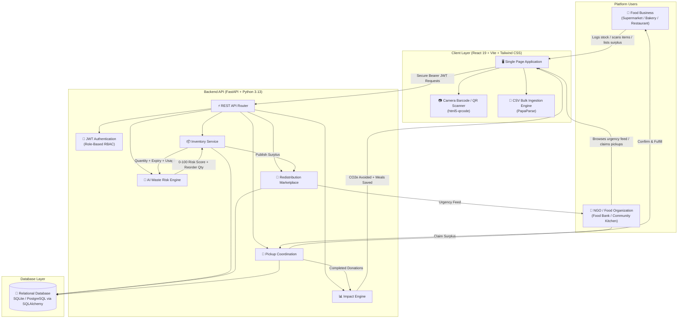

# Harvest Ledger — AI-Powered Food Waste Management Platform

[](https://github.com/preygoti/foodwaste-platform)
[](https://foodwaste-platform.vercel.app/)
[](https://foodwaste-platform.onrender.com/)
[](https://fastapi.tiangolo.com/)
[](https://python.org/)
[](https://react.dev/)
[](https://vitejs.dev/)
[](https://tailwindcss.com/)
[-F7DF1E?style=flat-square&logo=javascript)](https://developer.mozilla.org/en-US/docs/Web/JavaScript)

> **Harvest Ledger** is an intelligent, dual-sided web platform that connects food businesses (supermarkets, restaurants, bakeries, food distributors) with recipient non-profits (NGOs, food banks, community kitchens) to prevent landfill food waste, automate shelf-life tracking, and redistribute surplus food to communities in need.

---

## 🌐 Live Demo

| Component | URL | Hosting Platform |
|---|---|---|
| **Live Application (Frontend)** | [foodwaste-platform.vercel.app](https://foodwaste-platform.vercel.app/) | **Vercel** |
| **Backend API (REST Service)** | [foodwaste-platform.onrender.com](https://foodwaste-platform.onrender.com/) | **Render** |
| **Interactive API Documentation** | [foodwaste-platform.onrender.com/docs](https://foodwaste-platform.onrender.com/docs) | **Swagger UI / OpenAPI** |

---

## 🎯 Problem Statement

Food waste is one of the world's most pressing ecological and logistical challenges:

1. **Unmonitored Shelf-Life**: Food businesses struggle to track batch-level expiry dates accurately across hundreds of inventory items using manual spreadsheets or paper logs.
2. **Predictive Blindspots**: Without consumption analytics, businesses cannot forecast whether current stock will be consumed before expiring, leading to preventable spoilage.
3. **Redistribution Friction**: Near-expiry surplus food often ends up in landfills because businesses lack an instant, structured channel to notify local relief organizations.
4. **NGO Visibility Deficit**: Food banks and shelters rarely have real-time visibility into what surplus is available nearby, what requires immediate pickup, or how many meals it can yield.
5. **Unquantified Sustainability**: Businesses and NGOs lack centralized metrics to measure their environmental contributions ($CO_2e$ greenhouse gas emissions avoided) and community impact (meals saved).

---

## 💡 Solution

**Harvest Ledger** addresses this lifecycle through a closed-loop platform:

$$\text{Business Inventory} \longrightarrow \text{AI Waste Risk Scoring} \longrightarrow \text{Surplus Marketplace} \longrightarrow \text{NGO Claim} \longrightarrow \text{Pickup Coordination} \longrightarrow \text{Impact Analytics}$$

1. **Multi-Modal Inventory Ingestion**: Log items in seconds via **HTML5 Camera Barcode/QR Scanner**, **Bulk CSV Upload** (with downloadable validation templates), or **Manual Entry**.
2. **AI Waste Risk Engine**: Evaluates days-to-expiry against daily consumption rates to produce a **0–100 waste risk score** and a **smart reorder recommendation**.
3. **Redistribution Marketplace**: High-risk items can be published as surplus with one click. The marketplace sorts listings by urgency (soonest expiry first) so NGOs can rescue food before it spoils.
4. **Pickup Coordination Workflow**: NGOs claim surplus with meal projections; businesses confirm requests; status tracks through `pending` $\rightarrow$ `confirmed` $\rightarrow$ `picked_up`.
5. **Ecological & Social Impact**: Real-time dashboards compute kilograms of food rescued, $CO_2e$ greenhouse emissions avoided, and total meals served.

---

## 🏗️ How the Platform Works



---

## ⚡ Core Features & Capabilities

### 1. 📦 Inventory Management & Multi-Modal Entry
- **Manual Logging**: Fast entry form capturing name, category (`produce`, `dairy`, `bakery`, `prepared`, `canned`, `frozen`, `general`), quantity, unit, expiry date, average daily usage, and storage location.
- **Bulk CSV Upload**:
  - Downloadable sample CSV template (`item_name,category,quantity,unit,expiry_date,avg_daily_usage,storage_location`).
  - Pre-flight client-side validation with row-by-row error reporting (catches negative quantities, malformed dates, missing headers).
  - High-performance bulk ingestion via `POST /inventory/bulk-csv`.
- **Camera Barcode & QR Scanner**:
  - Mobile & desktop HTML5 camera stream with environment-facing lens support.
  - Live scanning of 1D barcodes (UPC-A, EAN-13, Code 128) and 2D QR codes.
  - Built-in grocery catalog dictionary that auto-resolves common food items and shelf-life presets.
  - Camera-denied manual barcode entry fallback.

### 2. 🧠 AI-Based Waste Risk Engine
Each inventory item is scored by a heuristic risk algorithm combining **shelf-life urgency** and **stock-to-demand ratio**:

$$\text{Days to Expiry } (DTE) = \text{expiry\_date} - \text{today}$$

$$\text{Stock Days} = \frac{\text{quantity}}{\text{avg\_daily\_usage}}$$

- **Risk Formula**:
  $$\text{Urgency Component} = \max\left(0, 1 - \frac{DTE}{14}\right) \times 60$$
  $$\text{Overstock Component} = \min\left(1, \max\left(0, \frac{\text{Stock Days}}{DTE} - 1\right)\right) \times 40$$
  $$\text{Risk Score} = \min(100, \max(0, \text{Urgency} + \text{Overstock}))$$

- **Risk Levels**:
  - 🔴 **HIGH RISK** ($\ge 70$): Immediate waste danger — recommended for marketplace listing.
  - 🟡 **WATCH** ($40 - 69$): Approaching critical threshold.
  - 🟢 **FRESH** ($< 40$): Healthy turnover rate.
- **Smart Reorder Recommendation**: Recommends optimal purchase quantity to cover a 7-day safety buffer without adding to spoilage risk.

### 3. 🏪 Redistribution Marketplace
- **One-Click Surplus Listing**: Food businesses convert at-risk inventory into public donations with custom quantities and pickup locations.
- **Urgency-Sorted NGO Feed**: Non-profits browse available food items sorted chronologically by soonest expiry date.
- **Meal Estimation**: Automatic conversion calculations ($\sim 2.5\text{ meals per kg}$) displayed to help NGOs plan distribution.

### 4. 🚚 Pickup Coordination & Lifecycle
- **Status Progression**:
  $$\texttt{available} \longrightarrow \texttt{matched (pending)} \longrightarrow \texttt{confirmed} \longrightarrow \texttt{picked\_up (completed)}$$
- **Donor Approval**: Businesses review incoming NGO requests, verify pickup times, and confirm release.
- **Completion Logging**: NGOs mark items as received to feed directly into community impact metrics.

### 5. 📊 Sustainability & Impact Analytics
- **Ecological Impact**: Calculates kilograms of food waste avoided and greenhouse gases prevented using standard conversion factors ($2.5\text{ kg } CO_2e\text{ saved per kg of food rescued}$).
- **Social Impact**: Tracks total meals redistributed to families.
- **Visual Dashboards**: Interactive charts built with **Recharts** showing inventory turnover, risk distribution, and donation fulfillment rates.

### 6. 📱 Responsive Modern UI/UX
- **Universal Device Support**: Tested and optimized for mobile screens ($375\text{px}$, $390\text{px}$, $430\text{px}$), tablets ($768\text{px}$), and desktop displays ($1024\text{px}$, $1440\text{px}+$ ).
- **Mobile Navigation Drawer**: Off-canvas slide-out menu with backdrop overlay, touch-friendly targets, and auto-closing navigation.
- **Desktop Flex Layout**: Cohesive side-by-side natural scrolling layout preventing floating sidebar overlap.
- **Zero Horizontal Overflow**: Enforced `overflow-x: hidden` across the entire application shell.

---

## 👥 User Roles & Permissions

| Role | Target Organizations | Capabilities |
|---|---|---|
| **Food Business** | Supermarkets, Bakeries, Restaurants, Grocers, Caterers | • Manage inventory ledger & track expiry countdowns<br/>• Scan barcodes/QRs and bulk upload CSVs<br/>• Monitor AI risk scores & reorder advice<br/>• List surplus food onto the marketplace<br/>• Confirm and manage incoming NGO pickup requests<br/>• View business impact analytics ($CO_2e$ saved, kg donated) |
| **NGO / Food Bank** | Food Rescue Groups, Shelters, Community Kitchens, Non-profits | • Browse live surplus listings ranked by urgency<br/>• Filter by food category and pickup proximity<br/>• Request food donations with estimated meal portions<br/>• Coordinate and complete scheduled pickups<br/>• View NGO impact metrics (meals received, active surplus) |

---

## 🛠️ Technology Stack

| Layer | Technology | Purpose |
|---|---|---|
| **Frontend Framework** | **React 19** | Modern component-driven UI architecture |
| **Build Tool** | **Vite 8** | Ultra-fast HMR and optimized production bundling |
| **Styling & Design** | **Tailwind CSS 3.4** | Utility-first responsive design system |
| **Routing** | **React Router v7** | Client-side routing with role-protected guards |
| **Data Visualization** | **Recharts 3** | Responsive ecological & operational impact charts |
| **Camera & Barcode** | **html5-qrcode** | HTML5 cross-platform barcode and QR code scanner |
| **CSV Parsing** | **PapaParse** | High-performance client-side CSV validation |
| **Icons** | **Lucide React** | Modern, lightweight SVG iconography |
| **Backend Framework** | **FastAPI 0.115** | High-performance asynchronous Python REST API |
| **Application Server** | **Uvicorn** | ASGI web server implementation |
| **ORM & Database** | **SQLAlchemy 2.0** + **SQLite / PostgreSQL** | Database modeling, sessions, and migrations |
| **Data Validation** | **Pydantic v2** | Strict request schema validation and serialization |
| **Security & Auth** | **Python-JOSE** + **Passlib (Bcrypt)** | JWT token authorization and password hashing |
| **Deployment** | **Vercel** + **Render** | Cloud hosting for frontend and backend web services |

---

## 📂 Project Structure

```text
foodwaste-platform/
├── backend/
│   ├── auth.py                  # JWT creation, bcrypt hashing, role dependencies
│   ├── database.py              # SQLAlchemy engine & session factory
│   ├── main.py                  # FastAPI application & REST endpoint routers
│   ├── models.py                # Database models (User, InventoryItem, Listing, Pickup)
│   ├── render.yaml              # Render cloud deployment specification
│   ├── requirements.txt         # Python backend dependencies
│   ├── risk_engine.py           # AI risk scoring & reorder recommendation logic
│   ├── schemas.py               # Pydantic request/response schemas
│   └── test_platform_full.py    # Automated end-to-end test suite
│
├── frontend/
│   ├── public/                  # Static assets & SVG icons
│   ├── src/
│   │   ├── assets/              # Branding assets
│   │   ├── components/
│   │   │   ├── BarcodeScannerModal.jsx # Camera barcode/QR scanner & catalog lookup
│   │   │   ├── CsvUploadModal.jsx      # CSV drag-and-drop & template validator
│   │   │   ├── Layout.jsx              # Responsive navigation & mobile drawer shell
│   │   │   └── RiskStamp.jsx           # Color-coded AI risk badge pill
│   │   ├── pages/
│   │   │   ├── AnalyticsPage.jsx       # Impact charts & metric cards
│   │   │   ├── BrowseListingsPage.jsx  # NGO urgency surplus feed & claim dialog
│   │   │   ├── BusinessListingsPage.jsx# Business surplus management & confirmation
│   │   │   ├── InventoryPage.jsx       # Inventory ledger, search, filters & actions
│   │   │   ├── Landing.jsx             # Public landing page & platform overview
│   │   │   ├── Login.jsx               # Account authentication page
│   │   │   ├── MyPickupsPage.jsx       # NGO scheduled pickup manager
│   │   │   └── Register.jsx            # Dual-role organization onboarding
│   │   ├── api.js               # Centralized fetch client for backend API
│   │   ├── App.jsx              # Application router & protected routes
│   │   ├── AuthContext.jsx      # User session state & token management
│   │   ├── index.css            # Global CSS, scrollbars & font imports
│   │   └── main.jsx             # React entry point
│   ├── package.json             # Frontend dependencies & npm scripts
│   ├── tailwind.config.js       # Custom palette (forest, wheat, tomato, gold)
│   ├── vercel.json              # Vercel SPA routing rewrite rules
│   └── vite.config.js           # Vite build configuration
│
└── README.md                    # Project documentation
```

---

## 🚀 Getting Started Locally

### Prerequisites
- **Node.js** (v18 or higher) & **npm**
- **Python** (v3.10 or higher)

---

### 1. Clone the Repository
```bash
git clone https://github.com/preygoti/foodwaste-platform.git
cd foodwaste-platform
```

---

### 2. Backend Setup
```bash
cd backend

# (Optional) Create and activate virtual environment
python -m venv .venv
# On Windows:
.venv\Scripts\activate
# On macOS/Linux:
source .venv/bin/activate

# Install dependencies
pip install -r requirements.txt

# Start FastAPI development server
uvicorn main:app --reload --port 8000
```
- **API Root**: `http://localhost:8000`
- **Swagger Interactive Docs**: `http://localhost:8000/docs`

---

### 3. Frontend Setup
In a new terminal window:
```bash
cd frontend

# Install npm packages
npm install

# Start Vite dev server
npm run dev
```
- **Web App**: `http://localhost:5173`
- The frontend connects to `http://localhost:8000` by default. To point to a live backend, create a `frontend/.env` file:
  ```env
  VITE_API_URL=https://foodwaste-platform.onrender.com
  ```

---

## 🧪 Testing the Full Workflow

1. Open `http://localhost:5173` and register two accounts in two separate browser windows (or incognito):
   - **Account 1**: Register as **Food Business** (e.g. `Fresh Market`).
   - **Account 2**: Register as **NGO / Food Bank** (e.g. `City Food Rescue`).
2. **As Food Business**:
   - Go to **Inventory** $\rightarrow$ click **"+ Add Item"** or **"Upload CSV"** or **"Scan Barcode / QR"**.
   - Review the calculated **Waste Risk Score** (0–100) and **Reorder Advice**.
   - Click **"List Surplus"** on any item $\rightarrow$ publish it to the marketplace.
3. **As NGO**:
   - Go to **Available Surplus** $\rightarrow$ observe the item ranked by soonest expiry.
   - Click **"Request Pickup"** $\rightarrow$ enter estimated meal portions and submit.
4. **Coordinate & Complete**:
   - Business goes to **Surplus Listings** $\rightarrow$ clicks **"Confirm Pickup"**.
   - NGO goes to **My Pickups** $\rightarrow$ clicks **"Mark Picked Up"**.
5. **View Impact**:
   - Both organizations can visit **Impact & Analytics** to see updated $CO_2e$ avoided and meals rescued.

### Running Automated Backend Tests
```bash
cd backend
python test_platform_full.py
```

### Running Frontend Production Build
```bash
cd frontend
npm run build
```

---

## 📊 API Endpoints Reference

| Method | Endpoint | Access | Description |
|---|---|---|---|
| `POST` | `/auth/register` | Public | Register new Business or NGO account |
| `POST` | `/auth/login` | Public | OAuth2 password login, returns JWT token |
| `GET` | `/auth/me` | Authenticated | Get current authenticated user profile |
| `GET` | `/inventory` | Business | List all inventory items with risk scores & reorder advice |
| `POST` | `/inventory` | Business | Create a new inventory record |
| `PATCH` | `/inventory/{id}` | Business | Update an existing inventory item |
| `DELETE` | `/inventory/{id}` | Business | Delete an inventory item |
| `POST` | `/inventory/bulk-csv` | Business | Ingest pre-validated bulk CSV rows |
| `GET` | `/inventory/{id}/risk` | Business | Get specific item risk evaluation |
| `GET` | `/inventory/at-risk` | Business | Filter items above risk threshold |
| `GET` | `/listings` | Authenticated | Browse available surplus items (urgency sorted) |
| `POST` | `/listings` | Business | Post inventory surplus item to marketplace |
| `GET` | `/listings/mine` | Business | Get all surplus listings posted by current business |
| `POST` | `/pickups` | NGO | Request a pickup for an available listing |
| `PATCH` | `/pickups/{id}` | Business / NGO | Update pickup status (`confirmed`, `picked_up`, `cancelled`) |
| `GET` | `/pickups/mine` | NGO | List all pickup requests made by current NGO |
| `GET` | `/listings/{id}/pickups` | Business | List all pickup requests for a specific listing |
| `GET` | `/analytics/business` | Business | Get business impact metrics ($CO_2e$ saved, donations) |
| `GET` | `/analytics/ngo` | NGO | Get NGO impact metrics (meals received, pickups) |

---

## 📜 License

This project is licensed under the **MIT License** — feel free to use, modify, and distribute for educational, non-profit, or commercial purposes.

---

<div align="center">
  <sub>Built with ❤️ for zero food waste and community nourishment.</sub>
</div>
