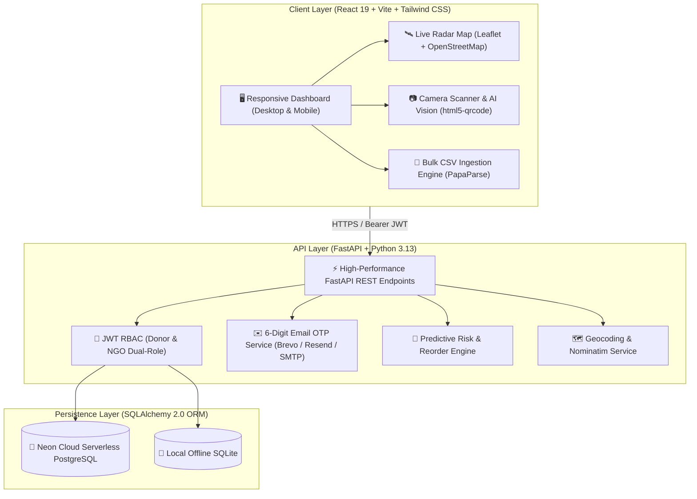
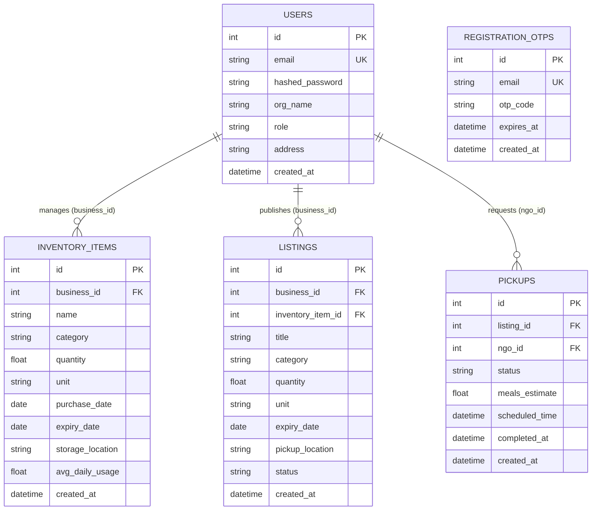

<div align="center">

# Harvest Ledger

### AI-Powered Commercial Food Waste Management & Community Redistribution Platform

[](https://foodwaste-platform.vercel.app)
[](https://www.linkedin.com/in/prey-goti-31a772318)
[](https://github.com/preygoti)
[](https://fastapi.tiangolo.com/)
[](https://react.dev/)
[](https://tailwindcss.com/)
[](LICENSE)

<br/>


</div>

---

## 🌟 Executive Overview

**Harvest Ledger** is an enterprise-grade food rescue ecosystem engineered to eliminate commercial food waste. It seamlessly bridges the gap between food donors (supermarkets, restaurants, bakeries, hotels, distributors) and verified non-profit hunger relief organizations (NGOs, food banks, community kitchens) through real-time inventory telemetry, multimodal AI freshness analysis, and cryptographic digital QR handshakes.

### 👤 Founder Accreditation
> **Founded & Built by [Prey Goti](https://github.com/preygoti)**  
> *Founder of Harvest Ledger and Full-Stack AI Engineer focused on building technology for smarter food waste management and community redistribution.*  
>  
> 🔗 [LinkedIn Profile](https://www.linkedin.com/in/prey-goti-31a772318) • [GitHub Profile](https://github.com/preygoti) • [Live Web App](https://foodwaste-platform.vercel.app)

---

## 🚀 Key Platform Capabilities

### 1. 📦 Smart Inventory Telemetry
- **Multi-Modal Logging**: Add batches manually, scan product barcodes using live camera OCR (`html5-qrcode`), or bulk import spreadsheets via client-side `PapaParse`.
- **Granular Shelf-Life Telemetry**: Tracks unit quantities (`kg`, `liters`, `units`, `portions`, `boxes`), storage zones (Cold Storage, Ambient Rack, Freezer), and reactive expiry countdown tickers.

### 2. 🧠 AI Freshness Inspector & Multimodal Vision
- **Computer Vision Spoilage Detection**: Analyzes perishable items to grade visual freshness, estimate remaining shelf-life, and flag high-risk batches.
- **Dynamic 0–100 Risk Engine**: Evaluates storage conditions and daily consumption velocity to classify items into `LOW`, `MEDIUM`, `HIGH`, or `CRITICAL` risk tiers before waste occurs.

### 3. 🍳 Zero-Waste Recipe Engine (Rescue Chef)
- **Culinary Repurposing**: AI-generated safe, creative recipes formulated from surplus ingredients to maximize kitchen yield and eliminate edible waste at the source.

### 4. 🛰️ Live Radar Map & Proximity Routing
- **100% Free OpenStreetMap & Leaflet**: Embedded proximity radar showing active surplus donors and non-profit centers with zero external API key fees or rate limits.
- **Smart Geocoding Pipeline**: Integrated offline coordinate dictionary for 100+ Indian & global metro areas coupled with OpenStreetMap Nominatim geocoding.
- **GPS Navigation**: Live Haversine distance calculation (`📍 1.2 km away`) and one-click Google Maps driving navigation.

### 5. 🤝 Cryptographic QR Handshake & Proof-of-Rescue
- **Competitive NGO Dispatch**: Non-profits discover listings and submit pickup requests in real time.
- **Digital Rescue Pass (`HL-RES-XXXX`)**: Generates secure driver passes with dynamic QR codes.
- **Storefront Verification**: Donors scan the driver's QR code at pickup to verify handoff, transfer chain of custody, and update the global ledger.

### 6. 📄 Automated ESG & CSR Tax Statements
- **Impact Metrics**: Automatic calculation of kilograms rescued, meals served, landfill methane diverted, and financial value recovered.
- **Section 80G & CSR Tax Certificates**: Generates audit-ready ESG statements and commercial tax deduction certificates with a single click.

---

## 🏗️ System Architecture



---

## 🗄️ Relational Schema



---

## 🛠️ Technology Stack

| Layer | Technology | Key Capabilities |
|---|---|---|
| **Frontend Framework** | **React 19**, **Vite 8** | High-performance single page application with modern hooks |
| **Styling & Design** | **Tailwind CSS 3.4**, **Lucide Icons** | Responsive warm wheat / deep forest design system |
| **Radar & Geolocation** | **Leaflet 1.9**, **OpenStreetMap** | Dynamic proximity mapping, GPS locating, and route generation |
| **Vision & Scanning** | **html5-qrcode** | Real-time barcode scanning and QR handshake verification |
| **Backend REST API** | **FastAPI 0.115**, **Python 3.13**, **Uvicorn** | Asynchronous Python backend with automatic OpenAPI/Swagger docs |
| **Database & ORM** | **PostgreSQL (Neon)**, **SQLite**, **SQLAlchemy 2.0** | Relational persistence with connection pooling and migrations |
| **Email Service** | **Brevo (Sendinblue)**, **Resend**, **SMTP** | 6-digit transactional registration and password reset OTPs |
| **Security & Auth** | **Python-JOSE**, **Passlib (Bcrypt)** | Stateless JWT tokens, role guards (RBAC), and salted hashes |

---

## 🚀 Getting Started

### Prerequisites
- **Node.js** (v18+) & **npm**
- **Python** (v3.10+)

---

### 1. Clone the Repository
```bash
git clone https://github.com/preygoti/foodwaste-platform.git
cd foodwaste-platform
```

---

### 2. Backend Setup
```bash
cd backend

# Create and activate virtual environment
python -m venv .venv

# Windows:
.venv\Scriptsctivate
# macOS/Linux:
source .venv/bin/activate

# Install dependencies
pip install -r requirements.txt

# (Optional) Configure Brevo API Key for live email OTPs:
# set BREVO_API_KEY=your_brevo_api_key_here

# Run backend development server
uvicorn main:app --reload --port 8000
```
- **Backend API**: `http://localhost:8000`
- **Swagger Documentation**: `http://localhost:8000/docs`

---

### 3. Frontend Setup
In a separate terminal window:
```bash
cd frontend

# Install dependencies
npm install

# Start Vite development server
npm run dev
```
- **Web Application**: `http://localhost:5173`

---

## 🧪 Verification & Automated Testing

### Backend Unit & Integration Suite
```bash
cd backend
python test_platform_full.py
```

### Frontend Production Build Test
```bash
cd frontend
npm run build
```

---

## 👤 Author & Connect

**Prey Goti** — *Founder & Full-Stack AI Engineer*

* 🌐 **Live Application**: [https://foodwaste-platform.vercel.app](https://foodwaste-platform.vercel.app)
* 💼 **LinkedIn**: [linkedin.com/in/prey-goti-31a772318](https://www.linkedin.com/in/prey-goti-31a772318)
* 🐙 **GitHub**: [@preygoti](https://github.com/preygoti)
* ✉️ **Project Repository**: [github.com/preygoti/foodwaste-platform](https://github.com/preygoti/foodwaste-platform)

---

## 📜 License

This project is open source and available under the **[MIT License](LICENSE)**.

<br/>

<div align="center">
  <sub>Harvest Ledger &bull; Engineered with ❤️ by <b>Prey Goti</b> to Eliminate Food Waste</sub>
</div>
