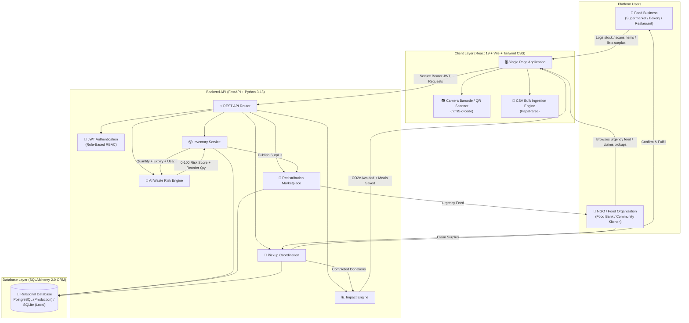
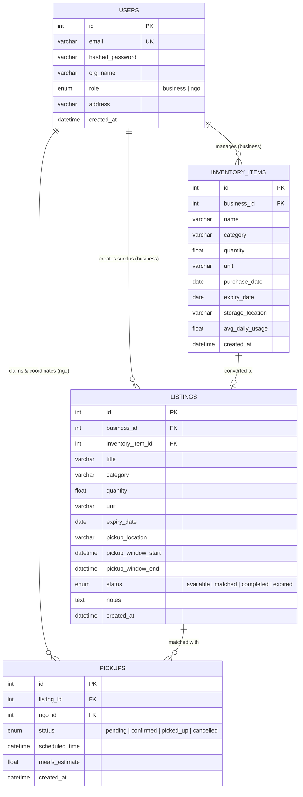

# Harvest Ledger — AI-Powered Food Waste Management Platform

[](https://github.com/preygoti/foodwaste-platform)
[](https://foodwaste-platform.vercel.app/)
[](https://foodwaste-platform.onrender.com/)
[](https://fastapi.tiangolo.com/)
[](https://python.org/)
[](https://www.postgresql.org/)
[](https://react.dev/)
[](https://vitejs.dev/)
[](https://tailwindcss.com/)
[-F7DF1E?style=flat-square&logo=javascript)](https://developer.mozilla.org/en-US/docs/Web/JavaScript)

> **Harvest Ledger** is an intelligent, dual-sided web platform that connects food businesses (supermarkets, restaurants, bakeries, food distributors) with recipient non-profits (NGOs, food banks, community kitchens) to prevent landfill food waste, automate shelf-life tracking, and redistribute surplus food to communities in need.

---

## 🌐 Live Application & API Links

| Service | URL | Hosting Platform | Purpose |
|---|---|---|---|
| **Live Web App (Frontend)** | [foodwaste-platform.vercel.app](https://foodwaste-platform.vercel.app/) | **Vercel** | Interactive Single Page Application for Businesses & NGOs |
| **Live API Backend** | [foodwaste-platform.onrender.com](https://foodwaste-platform.onrender.com/) | **Render** | Production FastAPI REST Web Service |
| **Interactive API Documentation** | [foodwaste-platform.onrender.com/docs](https://foodwaste-platform.onrender.com/docs) | **Swagger UI / OpenAPI** | Live interactive API testbed & endpoint specs |
| **API Alternative Docs** | [foodwaste-platform.onrender.com/redoc](https://foodwaste-platform.onrender.com/redoc) | **ReDoc** | Comprehensive API reference documentation |
| **GitHub Source Code** | [github.com/preygoti/foodwaste-platform](https://github.com/preygoti/foodwaste-platform) | **GitHub** | Version-controlled repository |

---

## 🎯 Problem Statement

Food waste is one of the world's most pressing ecological and logistical challenges:

1. **Unmonitored Shelf-Life**: Food businesses struggle to track batch-level expiry dates accurately across hundreds of inventory items using manual spreadsheets or paper logs.
2. **Predictive Blindspots**: Without consumption analytics, businesses cannot forecast whether current stock will be consumed before expiring, leading to preventable spoilage.
3. **Redistribution Friction**: Near-expiry surplus food often ends up in landfills because businesses lack an instant, structured channel to notify local relief organizations.
4. **NGO Visibility Deficit**: Food banks and shelters rarely have real-time visibility into what surplus is available nearby, what requires immediate pickup, or how many meals it can yield.
5. **Unquantified Sustainability**: Businesses and NGOs lack centralized metrics to measure their environmental contributions (CO₂e greenhouse gas emissions avoided) and community impact (meals saved).

---

## 💡 Solution

**Harvest Ledger** addresses this lifecycle through a closed-loop platform:

> **Business Inventory** → **AI Waste Risk Scoring** → **Surplus Marketplace** → **NGO Claim** → **Pickup Coordination** → **Impact Analytics**

1. **Multi-Modal Inventory Ingestion**: Log items in seconds via **HTML5 Camera Barcode/QR Scanner**, **Bulk CSV Upload** (with downloadable validation templates), or **Manual Entry**.
2. **AI Waste Risk Engine**: Evaluates days-to-expiry against daily consumption rates to produce a **0–100 waste risk score** and a **smart reorder recommendation**.
3. **Redistribution Marketplace**: High-risk items can be published as surplus with one click. The marketplace sorts listings by urgency (soonest expiry first) so NGOs can rescue food before it spoils.
4. **Pickup Coordination Workflow**: NGOs claim surplus with meal projections; businesses confirm requests; status tracks through `pending` → `confirmed` → `picked_up`.
5. **Ecological & Social Impact**: Real-time dashboards compute kilograms of food rescued, CO₂e greenhouse emissions avoided, and total meals served.

---

## 🏗️ System Architecture & Workflow



---

## 🗄️ Relational Database & SQL Schema

Harvest Ledger uses a normalized **Relational SQL Database** mapped via **SQLAlchemy 2.0 ORM**.

- **Production (Render)**: Managed **PostgreSQL** cloud database connected via `psycopg2-binary`.
- **Local Development**: **SQLite** (`sqlite:///./foodwaste.db`) with zero-configuration fallback.

### Entity-Relationship (ER) Diagram



---

### Detailed Table Specifications

#### 1. `users` Table
*Stores authenticated organization accounts for Food Businesses and NGOs.*

| Column Name | SQL Type | Constraints | Description |
|---|---|---|---|
| **`id`** | `INTEGER` | **PRIMARY KEY** (Auto-increment) | Unique user / organization ID |
| **`email`** | `VARCHAR` | `UNIQUE`, `NOT NULL`, `INDEX` | Account email address (case-insensitive login) |
| **`hashed_password`** | `VARCHAR` | `NOT NULL` | One-way salted Bcrypt cryptographic password hash |
| **`org_name`** | `VARCHAR` | `NOT NULL` | Registered store or NGO organization name |
| **`role`** | `VARCHAR / ENUM` | `NOT NULL` | Account authorization type: `'business'` or `'ngo'` |
| **`address`** | `VARCHAR` | `DEFAULT ""` | Physical location / pickup facility address |
| **`created_at`** | `TIMESTAMP` | `DEFAULT CURRENT_TIMESTAMP` | Account registration timestamp |

---

#### 2. `inventory_items` Table
*Stores food inventory tracked by Food Businesses.*

| Column Name | SQL Type | Constraints | Description |
|---|---|---|---|
| **`id`** | `INTEGER` | **PRIMARY KEY** (Auto-increment) | Unique inventory item ID |
| **`business_id`** | `INTEGER` | **FOREIGN KEY** $\rightarrow$ `users(id)` | Owner business user ID (`ON DELETE CASCADE`) |
| **`name`** | `VARCHAR` | `NOT NULL` | Food product name (e.g. *"Organic Whole Milk"*) |
| **`category`** | `VARCHAR` | `DEFAULT "general"` | Category (`produce`, `dairy`, `bakery`, `prepared`, etc.) |
| **`quantity`** | `FLOAT` | `NOT NULL` | In-stock quantity |
| **`unit`** | `VARCHAR` | `DEFAULT "kg"` | Measurement unit (`kg`, `liter`, `boxes`, `items`) |
| **`purchase_date`** | `DATE` | `DEFAULT CURRENT_DATE` | Date inventory was acquired |
| **`expiry_date`** | `DATE` | `NOT NULL` | Expiration / Best-before date |
| **`storage_location`** | `VARCHAR` | `DEFAULT ""` | Storage facility zone (e.g. *"Cold Storage A"*) |
| **`avg_daily_usage`** | `FLOAT` | `DEFAULT 1.0` | Daily consumption velocity (demand proxy) |
| **`created_at`** | `TIMESTAMP` | `DEFAULT CURRENT_TIMESTAMP` | Record creation timestamp |

---

#### 3. `listings` Table
*Stores surplus food published to the public marketplace for NGO donation.*

| Column Name | SQL Type | Constraints | Description |
|---|---|---|---|
| **`id`** | `INTEGER` | **PRIMARY KEY** (Auto-increment) | Unique marketplace listing ID |
| **`business_id`** | `INTEGER` | **FOREIGN KEY** $\rightarrow$ `users(id)` | Publishing business user ID (`ON DELETE CASCADE`) |
| **`inventory_item_id`**| `INTEGER` | **FOREIGN KEY** $\rightarrow$ `inventory_items(id)` | Associated inventory record (optional, `ON DELETE SET NULL`) |
| **`title`** | `VARCHAR` | `NOT NULL` | Donation headline / description |
| **`category`** | `VARCHAR` | `DEFAULT "general"` | Food category |
| **`quantity`** | `FLOAT` | `NOT NULL` | Quantity available for donation |
| **`unit`** | `VARCHAR` | `DEFAULT "kg"` | Measurement unit |
| **`expiry_date`** | `DATE` | `NOT NULL` | Expiration date of surplus |
| **`pickup_location`** | `VARCHAR` | `NOT NULL` | Collection address |
| **`pickup_window_start`**| `TIMESTAMP` | `NULLABLE` | Earliest pickup time |
| **`pickup_window_end`** | `TIMESTAMP` | `NULLABLE` | Latest pickup time |
| **`status`** | `VARCHAR / ENUM` | `DEFAULT "available"` | Status: `'available'`, `'matched'`, `'completed'`, `'expired'` |
| **`notes`** | `TEXT` | `DEFAULT ""` | Special handling or dietary guidelines |
| **`created_at`** | `TIMESTAMP` | `DEFAULT CURRENT_TIMESTAMP` | Publishing timestamp |

---

#### 4. `pickups` Table
*Coordinates claim requests, scheduling, and fulfillment between NGOs and donor businesses.*

| Column Name | SQL Type | Constraints | Description |
|---|---|---|---|
| **`id`** | `INTEGER` | **PRIMARY KEY** (Auto-increment) | Unique pickup transaction ID |
| **`listing_id`** | `INTEGER` | **FOREIGN KEY** $\rightarrow$ `listings(id)` | Claimed surplus listing (`ON DELETE CASCADE`) |
| **`ngo_id`** | `INTEGER` | **FOREIGN KEY** $\rightarrow$ `users(id)` | Requesting NGO user ID (`ON DELETE CASCADE`) |
| **`status`** | `VARCHAR / ENUM` | `DEFAULT "pending"` | Status: `'pending'`, `'confirmed'`, `'picked_up'`, `'cancelled'` |
| **`scheduled_time`** | `TIMESTAMP` | `NULLABLE` | Target collection date and time |
| **`meals_estimate`** | `FLOAT` | `DEFAULT 0.0` | Projected meal portions served to the community |
| **`created_at`** | `TIMESTAMP` | `DEFAULT CURRENT_TIMESTAMP` | Claim request timestamp |

---

### Standard SQL DDL (Table Creation Code)

```sql
-- 1. Users Table
CREATE TABLE users (
    id SERIAL PRIMARY KEY,
    email VARCHAR(255) UNIQUE NOT NULL,
    hashed_password VARCHAR(255) NOT NULL,
    org_name VARCHAR(255) NOT NULL,
    role VARCHAR(50) NOT NULL CHECK (role IN ('business', 'ngo')),
    address VARCHAR(255) DEFAULT '',
    created_at TIMESTAMP DEFAULT CURRENT_TIMESTAMP
);

-- 2. Inventory Items Table
CREATE TABLE inventory_items (
    id SERIAL PRIMARY KEY,
    business_id INTEGER NOT NULL REFERENCES users(id) ON DELETE CASCADE,
    name VARCHAR(255) NOT NULL,
    category VARCHAR(100) DEFAULT 'general',
    quantity FLOAT NOT NULL,
    unit VARCHAR(50) DEFAULT 'kg',
    purchase_date DATE DEFAULT CURRENT_DATE,
    expiry_date DATE NOT NULL,
    storage_location VARCHAR(255) DEFAULT '',
    avg_daily_usage FLOAT DEFAULT 1.0,
    created_at TIMESTAMP DEFAULT CURRENT_TIMESTAMP
);

-- 3. Marketplace Listings Table
CREATE TABLE listings (
    id SERIAL PRIMARY KEY,
    business_id INTEGER NOT NULL REFERENCES users(id) ON DELETE CASCADE,
    inventory_item_id INTEGER REFERENCES inventory_items(id) ON DELETE SET NULL,
    title VARCHAR(255) NOT NULL,
    category VARCHAR(100) DEFAULT 'general',
    quantity FLOAT NOT NULL,
    unit VARCHAR(50) DEFAULT 'kg',
    expiry_date DATE NOT NULL,
    pickup_location VARCHAR(255) NOT NULL,
    pickup_window_start TIMESTAMP,
    pickup_window_end TIMESTAMP,
    status VARCHAR(50) DEFAULT 'available' CHECK (status IN ('available', 'matched', 'completed', 'expired')),
    notes TEXT DEFAULT '',
    created_at TIMESTAMP DEFAULT CURRENT_TIMESTAMP
);

-- 4. Pickups Table
CREATE TABLE pickups (
    id SERIAL PRIMARY KEY,
    listing_id INTEGER NOT NULL REFERENCES listings(id) ON DELETE CASCADE,
    ngo_id INTEGER NOT NULL REFERENCES users(id) ON DELETE CASCADE,
    status VARCHAR(50) DEFAULT 'pending' CHECK (status IN ('pending', 'confirmed', 'picked_up', 'cancelled')),
    scheduled_time TIMESTAMP,
    meals_estimate FLOAT DEFAULT 0.0,
    created_at TIMESTAMP DEFAULT CURRENT_TIMESTAMP
);
```

---

## ⚡ Core Features & Capabilities

### 1. 📦 Multi-Modal Inventory Ingestion
- **Manual Logging**: Comprehensive entry form capturing item name, category (`produce`, `dairy`, `bakery`, `prepared`, `canned`, `frozen`, `general`), quantity, unit, expiry date, average daily usage, and storage location.
- **Bulk CSV Upload**:
  - Downloadable sample CSV template (`item_name,category,quantity,unit,expiry_date,avg_daily_usage,storage_location`).
  - Pre-flight client-side validation with row-by-row error reporting (catches negative quantities, malformed dates, missing headers).
  - High-performance bulk ingestion endpoint via `POST /inventory/bulk-csv`.
- **Camera Barcode & QR Scanner**:
  - Mobile & desktop HTML5 camera stream with environment-facing lens support.
  - Live scanning of 1D barcodes (UPC-A, EAN-13, Code 128) and 2D QR codes.
  - Built-in grocery catalog dictionary that auto-resolves common food items and shelf-life presets.
  - Camera-denied manual barcode entry fallback.

### 2. 🧠 AI-Based Waste Risk Engine
Each inventory item is dynamically scored by a heuristic risk algorithm combining **shelf-life urgency** and **stock-to-demand ratio**:

$$
\text{Days to Expiry (DTE)} = \text{expiry date} - \text{today}
$$

$$
\text{Stock Days} = \frac{\text{quantity}}{\text{average daily usage}}
$$

- **Risk Formula**:

$$
\text{Urgency Component} = \max\left(0, 1 - \frac{\text{DTE}}{14}\right) \times 60
$$

$$
\text{Overstock Component} = \min\left(1, \max\left(0, \frac{\text{Stock Days}}{\text{DTE}} - 1\right)\right) \times 40
$$

$$
\text{Risk Score} = \min(100, \max(0, \text{Urgency Component} + \text{Overstock Component}))
$$

- **Risk Levels**:
  - 🔴 **HIGH RISK** ($\ge 70$): Immediate waste danger — recommended for marketplace listing.
  - 🟡 **WATCH** ($40 - 69$): Approaching critical threshold.
  - 🟢 **FRESH** ($< 40$): Healthy turnover rate.
- **Smart Reorder Recommendation**: Recommends optimal purchase quantity to maintain a 7-day safety buffer without causing spoilage.

### 3. 🏪 Redistribution Marketplace
- **One-Click Surplus Listing**: Food businesses convert at-risk inventory into public donations with custom quantities and pickup locations.
- **Urgency-Sorted NGO Feed**: Non-profits browse available food items sorted chronologically by soonest expiry date.
- **Meal Estimation**: Automatic conversion calculations (~2.5 meals per kg) displayed to help NGOs plan distribution.

### 4. 🚚 Pickup Coordination & Lifecycle
- **Status Progression**:
  `available` → `matched (pending)` → `confirmed` → `picked_up (completed)`
- **Donor Approval**: Businesses review incoming NGO requests, verify pickup times, and confirm release.
- **Completion Logging**: NGOs mark items as received to feed directly into community impact metrics.

### 5. 📊 Sustainability & Impact Analytics
- **Ecological Impact**: Calculates kilograms of food waste avoided and greenhouse gases prevented using standard conversion factors (2.5 kg CO₂e saved per kg of food rescued).
- **Social Impact**: Tracks total meals redistributed to families.
- **Visual Dashboards**: Interactive charts built with **Recharts** showing inventory turnover, risk distribution, and donation fulfillment rates.

### 6. 📱 Responsive Modern UI/UX
- **Universal Device Support**: Tested and optimized for mobile screens (375px, 390px, 430px), tablets (768px), and desktop displays (1024px, 1440px+).
- **Mobile Navigation Drawer**: Off-canvas slide-out menu with backdrop overlay, touch-friendly targets, and auto-closing navigation.
- **Desktop Flex Layout**: Cohesive side-by-side natural scrolling layout preventing floating sidebar overlap.
- **Zero Horizontal Overflow**: Enforced `overflow-x: hidden` across the entire application shell.

---

## 👥 User Roles & Permissions

| Role | Target Organizations | Capabilities |
|---|---|---|
| **Food Business** | Supermarkets, Bakeries, Restaurants, Grocers, Caterers | • Manage inventory ledger & track expiry countdowns<br/>• Scan barcodes/QRs and bulk upload CSVs<br/>• Monitor AI risk scores & reorder advice<br/>• List surplus food onto the marketplace<br/>• Confirm and manage incoming NGO pickup requests<br/>• View business impact analytics (CO₂e saved, kg donated) |
| **NGO / Food Bank** | Food Rescue Groups, Shelters, Community Kitchens, Non-profits | • Browse live surplus listings ranked by urgency<br/>• Filter by food category and pickup proximity<br/>• Request food donations with estimated meal portions<br/>• Coordinate and complete scheduled pickups<br/>• View NGO impact metrics (meals received, active surplus) |

---

## 🛠️ Technology Stack

| Layer | Technology | Purpose |
|---|---|---|
| **Frontend Framework** | **React 19** | Component-driven Single Page Application UI |
| **Build Tool** | **Vite 8** | High-speed build tool and hot-module replacement |
| **Styling & Design** | **Tailwind CSS 3.4** | Utility-first responsive design system |
| **Routing** | **React Router v7** | Role-protected client-side routing |
| **Data Visualization** | **Recharts 3** | Responsive ecological & operational impact charts |
| **Camera & Barcode** | **html5-qrcode** | HTML5 cross-platform barcode and QR code scanner |
| **CSV Parsing** | **PapaParse** | High-performance client-side CSV validation |
| **Icons** | **Lucide React** | Modern, lightweight SVG iconography |
| **Backend Framework** | **FastAPI 0.115** | Asynchronous Python REST API framework |
| **Application Server** | **Uvicorn** | ASGI web server implementation |
| **Database & ORM** | **PostgreSQL** + **SQLAlchemy 2.0** | Production relational SQL database and ORM |
| **Local Database** | **SQLite** | Zero-configuration offline local database |
| **Data Validation** | **Pydantic v2** | Strict request schema validation and serialization |
| **Security & Auth** | **Python-JOSE** + **Passlib (Bcrypt)** | JWT token authorization and salted password hashing |
| **Deployment** | **Vercel** + **Render** | Cloud hosting for frontend and backend web services |

---

## 📂 Project Structure

```text
foodwaste-platform/
├── backend/
│   ├── auth.py                  # JWT creation, bcrypt hashing, role dependencies
│   ├── database.py              # SQLAlchemy engine, PostgreSQL/SQLite URL normalization
│   ├── main.py                  # FastAPI application, CORS configuration & REST routers
│   ├── models.py                # Database models (User, InventoryItem, Listing, Pickup)
│   ├── render.yaml              # Render cloud deployment blueprint with PostgreSQL
│   ├── requirements.txt         # Python backend dependencies (FastAPI, SQLAlchemy, psycopg2)
│   ├── risk_engine.py           # AI risk scoring & reorder recommendation logic
│   ├── schemas.py               # Pydantic request/response schemas
│   ├── test_platform_full.py    # Automated end-to-end test suite (8 tests)
│   └── .env.example             # Backend environment template (DATABASE_URL, JWT_SECRET)
│
├── frontend/
│   ├── public/                  # Static assets & SVG icons
│   ├── src/
│   │   ├── assets/              # Branding assets
│   │   ├── components/
│   │   │   ├── BarcodeScannerModal.jsx # Camera barcode/QR scanner & catalog lookup
│   │   │   ├── CsvUploadModal.jsx      # CSV drag-and-drop & template validator
│   │   │   ├── Layout.jsx              # Responsive navigation & mobile drawer shell
│   │   │   └── RiskStamp.jsx           # Color-coded AI risk badge pill
│   │   ├── pages/
│   │   │   ├── AnalyticsPage.jsx       # Impact charts & metric cards
│   │   │   ├── BrowseListingsPage.jsx  # NGO urgency surplus feed & claim dialog
│   │   │   ├── BusinessListingsPage.jsx# Business surplus management & confirmation
│   │   │   ├── InventoryPage.jsx       # Inventory ledger, search, filters & actions
│   │   │   ├── Landing.jsx             # Public landing page & platform overview
│   │   │   ├── Login.jsx               # Account authentication page
│   │   │   ├── MyPickupsPage.jsx       # NGO scheduled pickup manager
│   │   │   └── Register.jsx            # Dual-role organization onboarding
│   │   ├── api.js               # Centralized fetch client for backend API
│   │   ├── App.jsx              # Application router & protected routes
│   │   ├── AuthContext.jsx      # Multi-tab synchronized auth & token state
│   │   ├── index.css            # Global CSS, scrollbars & font imports
│   │   └── main.jsx             # React entry point
│   ├── package.json             # Frontend dependencies & npm scripts
│   ├── tailwind.config.js       # Custom palette (forest, wheat, tomato, gold)
│   ├── vercel.json              # Vercel SPA routing rewrite rules
│   ├── vite.config.js           # Vite build configuration
│   └── .env.example             # Frontend environment template (VITE_API_URL)
│
└── README.md                    # Project documentation
```

---

## 🚀 Getting Started Locally

### Prerequisites
- **Node.js** (v18 or higher) & **npm**
- **Python** (v3.10 or higher)

---

### 1. Clone the Repository
```bash
git clone https://github.com/preygoti/foodwaste-platform.git
cd foodwaste-platform
```

---

### 2. Backend Setup
```bash
cd backend

# (Optional) Create and activate virtual environment
python -m venv .venv
# On Windows:
.venv\Scripts\activate
# On macOS/Linux:
source .venv/bin/activate

# Install dependencies
pip install -r requirements.txt

# Start FastAPI development server
uvicorn main:app --reload --port 8000
```
- **API Root**: `http://localhost:8000`
- **Swagger Interactive Docs**: `http://localhost:8000/docs`

---

### 3. Frontend Setup
In a new terminal window:
```bash
cd frontend

# Install npm packages
npm install

# Start Vite dev server
npm run dev
```
- **Web App**: `http://localhost:5173`
- The frontend connects to `http://localhost:8000` locally. To point to the live cloud backend, create `frontend/.env`:
  ```env
  VITE_API_URL=https://foodwaste-platform.onrender.com
  ```

---

## 🧪 Testing the Full Workflow

1. Open `http://localhost:5173` (or the live URL) and register two accounts:
   - **Account 1**: Register as **Food Business** (e.g. `Fresh Market`).
   - **Account 2**: Register as **NGO / Food Bank** (e.g. `City Food Rescue`).
2. **As Food Business**:
   - Go to **Inventory** → click **"+ Add Item"** or **"Upload CSV"** or **"Scan Barcode / QR"**.
   - Review the calculated **Waste Risk Score** (0–100) and **Reorder Advice**.
   - Click **"List Surplus"** on any item → publish it to the marketplace.
3. **As NGO**:
   - Go to **Available Surplus** → observe the item ranked by soonest expiry.
   - Click **"Request Pickup"** → enter estimated meal portions and submit.
4. **Coordinate & Complete**:
   - Business goes to **Surplus Listings** → clicks **"Confirm Pickup"**.
   - NGO goes to **My Pickups** → clicks **"Mark Picked Up"**.
5. **View Impact**:
   - Both organizations can visit **Impact & Analytics** to see updated CO₂e avoided and meals rescued.

### Running Automated Backend Tests
```bash
cd backend
python test_platform_full.py
```

### Running Frontend Production Build
```bash
cd frontend
npm run build
```

---

## 📊 API Endpoints Reference

| Method | Endpoint | Access | Description |
|---|---|---|---|
| `POST` | `/auth/register` | Public | Register new Business or NGO account |
| `POST` | `/auth/login` | Public | OAuth2 password login, returns JWT token |
| `GET` | `/auth/me` | Authenticated | Get current authenticated user profile |
| `GET` | `/inventory` | Business | List all inventory items with risk scores & reorder advice |
| `POST` | `/inventory` | Business | Create a new inventory record |
| `PATCH` | `/inventory/{id}` | Business | Update an existing inventory item |
| `DELETE` | `/inventory/{id}` | Business | Delete an inventory item |
| `POST` | `/inventory/bulk-csv` | Business | Ingest pre-validated bulk CSV rows |
| `GET` | `/inventory/{id}/risk` | Business | Get specific item risk evaluation |
| `GET` | `/inventory/at-risk` | Business | Filter items above risk threshold |
| `GET` | `/listings` | Authenticated | Browse available surplus items (urgency sorted) |
| `POST` | `/listings` | Business | Post inventory surplus item to marketplace |
| `GET` | `/listings/mine` | Business | Get all surplus listings posted by current business |
| `POST` | `/pickups` | NGO | Request a pickup for an available listing |
| `PATCH` | `/pickups/{id}` | Business / NGO | Update pickup status (`confirmed`, `picked_up`, `cancelled`) |
| `GET` | `/pickups/mine` | NGO | List all pickup requests made by current NGO |
| `GET` | `/listings/{id}/pickups` | Business | List all pickup requests for a specific listing |
| `GET` | `/analytics/business` | Business | Get business impact metrics (CO₂e saved, donations) |
| `GET` | `/analytics/ngo` | NGO | Get NGO impact metrics (meals received, pickups) |

---

## 📜 License

This project is licensed under the **MIT License** — feel free to use, modify, and distribute for educational, non-profit, or commercial purposes.

---

<div align="center">
  <sub>Built with ❤️ for zero food waste and community nourishment.</sub>
</div>
