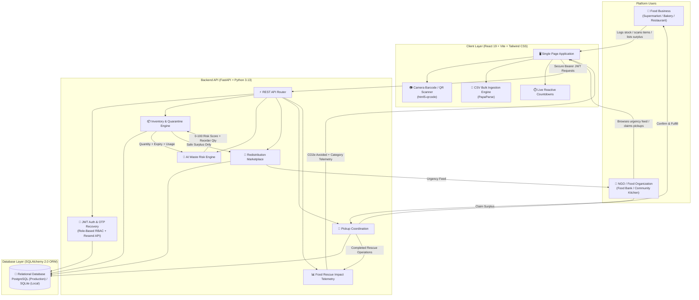
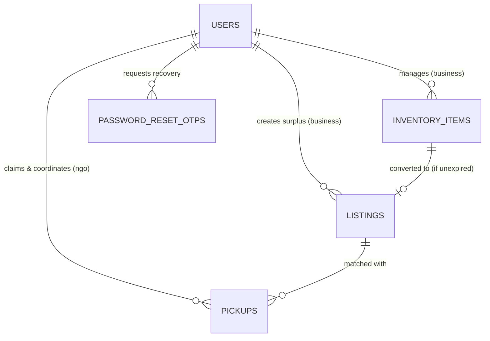

# Harvest Ledger — AI-Powered Food Waste Management Platform

[](https://github.com/preygoti/foodwaste-platform)
[](https://foodwaste-platform.vercel.app/)
[](https://foodwaste-platform.onrender.com/)
[](https://fastapi.tiangolo.com/)
[](https://python.org/)
[](https://www.postgresql.org/)
[](https://react.dev/)
[](https://vitejs.dev/)
[](https://tailwindcss.com/)
[-F7DF1E?style=flat-square&logo=javascript)](https://developer.mozilla.org/en-US/docs/Web/JavaScript)

> **Harvest Ledger** is an intelligent, dual-sided web platform that connects food businesses (supermarkets, restaurants, bakeries, food distributors) with recipient non-profits (NGOs, food banks, community kitchens) to prevent landfill food waste, automate shelf-life tracking, and redistribute surplus food to communities in need.

---

## 🌐 Live Application & Links

| Service | Link | Hosting Platform | Purpose |
|---|---|---|---|
| **Live Web App (Frontend)** | [foodwaste-platform.vercel.app](https://foodwaste-platform.vercel.app/) | **Vercel** | Interactive Single Page Application for Businesses & NGOs |
| **Live API Backend** | [foodwaste-platform.onrender.com](https://foodwaste-platform.onrender.com/) | **Render** | Production FastAPI REST Web Service |
| **Interactive API Documentation** | [foodwaste-platform.onrender.com/docs](https://foodwaste-platform.onrender.com/docs) | **Swagger UI / OpenAPI** | Live interactive API testbed & endpoint specs |
| **GitHub Source Code** | [github.com/preygoti/foodwaste-platform](https://github.com/preygoti/foodwaste-platform) | **GitHub** | Version-controlled repository |

---

## 🎯 Problem Statement

Food waste is one of the world's most pressing ecological and logistical challenges:

1. **Unmonitored Shelf-Life**: Food businesses struggle to track batch-level expiry dates accurately across hundreds of inventory items using manual spreadsheets or paper logs.
2. **Predictive Blindspots**: Without consumption analytics, businesses cannot forecast whether current stock will be consumed before expiring, leading to preventable spoilage.
3. **Redistribution Friction**: Near-expiry surplus food often ends up in landfills because businesses lack an instant, structured channel to notify local relief organizations.
4. **NGO Visibility Deficit**: Food banks and shelters rarely have real-time visibility into what surplus is available nearby, what requires immediate pickup, or how many meals it can yield.
5. **Food Safety Violations**: Without quarantine controls, expired food can inadvertently get mixed with donations, creating public health risks.
6. **Unquantified Sustainability**: Businesses and NGOs lack centralized metrics to measure their environmental contributions (CO₂e greenhouse gas emissions avoided) and community impact (meals saved).

---

## 💡 Solution & Core Modules

**Harvest Ledger** addresses this lifecycle through a closed-loop ecosystem:

> **Inventory Ingestion & Live Countdowns** → **AI Risk Engine** → **Safety Quarantine** → **Surplus Marketplace** → **NGO Claim** → **Pickup Coordination** → **Food Rescue Dashboard**

1. **Multi-Modal Inventory Ingestion**: Log items via **HTML5 Camera Barcode/QR Scanner**, **Bulk CSV Upload** (with downloadable validation templates), or **Manual Entry**.
2. **⏱️ Live Real-Time Expiry Countdown Timers**: Second-by-second live countdowns on every item with urgency color-coding (Fresh $\rightarrow$ Watch $\rightarrow$ Expiring Today $\rightarrow$ Expired).
3. **🛡️ Expired Items Quarantine & Food Safety Enforcement**: Dedicated segregated tab for expired goods. Expired food is strictly **blocked from being listed on the surplus marketplace** to comply with food safety standards.
4. **🧠 AI Waste Risk Engine**: Evaluates days-to-expiry against daily consumption velocity to produce a **0–100 waste risk score** and a **smart reorder recommendation**.
5. **🏪 Redistribution Marketplace**: Safe, near-expiry surplus items are published to the marketplace sorted by urgency (soonest expiry first) for local NGOs.
6. **🚚 Pickup Coordination Workflow**: NGOs claim surplus with meal projections; businesses confirm requests; status tracks through `pending` → `confirmed` → `picked_up`.
7. **🔐 Account Recovery via Email OTP**: Secure 4-step password recovery with 6-digit hashed OTPs, 10-minute expiry, rate-limiting, and **Resend HTTPS API** email dispatch.
8. **📊 Food Rescue & Sustainability Dashboard**: Real-time impact telemetry reporting `Listings Active`, `Food Rescued (kg)`, `CO2 Prevented (kg)`, `Active NGOs`, perishable category volume breakdowns, top donor leaderboards, and live rescue operations tables.

---

## 🏗️ System Architecture



---

## 🗄️ Relational Data Architecture

Harvest Ledger utilizes a relational SQL database with **SQLAlchemy 2.0 ORM**:
- **Production**: Managed **PostgreSQL** cloud database on Render.
- **Local Development**: Lightweight **SQLite** database for zero-setup offline testing.

### Entity Relationships



### Core Entities

| Entity | Primary Purpose | Key Attributes |
|---|---|---|
| **`Users`** | Identity management & Role-Based Access Control (RBAC) | Email, Organization Name, Role (`business` / `ngo`), Address |
| **`PasswordResetOTPs`** | Cryptographically hashed single-use OTP codes for password recovery | Email, Hashed OTP, Expiration Timestamp, Is Used Flag, Attempts |
| **`InventoryItems`** | Batch tracking of food stock, shelf life, and velocity | Item Name, Category, Quantity, Expiry Date, Daily Usage Rate |
| **`Listings`** | Safe surplus food available on the donation marketplace | Title, Quantity, Expiry Date, Pickup Location, Listing Status |
| **`Pickups`** | Coordination between donor business and claiming NGO | Scheduled Pickup Time, Estimated Meals, Pickup Status |

---

## 🧠 AI-Based Waste Risk Engine

Each inventory item is dynamically scored by a heuristic risk algorithm combining **shelf-life urgency** and **stock-to-demand ratio**:

$$
\text{Days to Expiry (DTE)} = \text{expiry date} - \text{today}
$$

$$
\text{Stock Days} = \frac{\text{quantity}}{\text{average daily usage}}
$$

- **Risk Formula**:

$$
\text{Urgency Component} = \max\left(0, 1 - \frac{\text{DTE}}{14}\right) \times 60
$$

$$
\text{Overstock Component} = \min\left(1, \max\left(0, \frac{\text{Stock Days}}{\text{DTE}} - 1\right)\right) \times 40
$$

$$
\text{Risk Score} = \min(100, \max(0, \text{Urgency Component} + \text{Overstock Component}))
$$

- **Risk Categories**:
  - 🔴 **HIGH RISK** ($\ge 70$): Immediate waste danger — recommended for marketplace listing.
  - 🟡 **WATCH** ($40 - 69$): Approaching critical threshold.
  - 🟢 **FRESH** ($< 40$): Healthy turnover rate.
- **Smart Reorder Recommendation**: Recommends optimal purchase quantity to maintain a 7-day safety buffer without causing spoilage.

---

## 👥 User Roles & Permissions

| Role | Target Organizations | Capabilities |
|---|---|---|
| **Food Business** | Supermarkets, Bakeries, Restaurants, Grocers, Caterers | • Manage active inventory & view live second-by-second countdowns<br/>• Quarantined Expired Items section with disposal logs<br/>• Scan barcodes/QRs and bulk upload CSVs<br/>• Monitor AI risk scores & reorder advice<br/>• Publish surplus food to the marketplace (food-safety protected)<br/>• Confirm incoming NGO pickup requests<br/>• View business & Food Rescue impact analytics |
| **NGO / Food Bank** | Food Rescue Groups, Shelters, Community Kitchens, Non-profits | • Browse live surplus listings ranked by urgency<br/>• Filter by food category and pickup proximity<br/>• Request food donations with estimated meal portions<br/>• Coordinate and complete scheduled pickups<br/>• View NGO impact metrics & Food Rescue Dashboard |

---

## 🛠️ Technology Stack

| Layer | Technology | Purpose |
|---|---|---|
| **Frontend Framework** | **React 19** | Modern component-driven Single Page Application UI |
| **Build Tool** | **Vite 8** | High-speed build tool and hot-module replacement |
| **Styling & Design** | **Tailwind CSS 3.4** | Utility-first responsive design system |
| **Routing** | **React Router v7** | Role-protected client-side routing |
| **Data Visualization** | **Recharts 3** | Category breakdown charts & impact telemetry |
| **Camera & Barcode** | **html5-qrcode** | Cross-platform barcode and QR code scanner |
| **CSV Parsing** | **PapaParse** | High-performance client-side CSV validation |
| **Icons** | **Lucide React** | Modern, lightweight SVG iconography |
| **Backend Framework** | **FastAPI 0.115** | Asynchronous Python REST API framework |
| **Application Server** | **Uvicorn** | ASGI web server implementation |
| **Database & ORM** | **PostgreSQL** + **SQLAlchemy 2.0** | Production relational SQL database and ORM |
| **Local Database** | **SQLite** | Zero-configuration offline local database |
| **Data Validation** | **Pydantic v2** | Strict request schema validation and serialization |
| **Security & Auth** | **Python-JOSE** + **Passlib (Bcrypt)** | JWT token authorization and salted password hashing |
| **Email Dispatch** | **Resend HTTPS REST API** | HTTPS-based OTP email delivery for production |
| **Deployment** | **Vercel** + **Render** | Cloud hosting for frontend and backend web services |

---

## 📂 Project Structure

```text
foodwaste-platform/
├── backend/
│   ├── auth.py                  # JWT creation, bcrypt hashing, role dependencies
│   ├── database.py              # SQLAlchemy engine & URL normalization
│   ├── email_service.py         # Resend HTTPS REST email dispatch service
│   ├── main.py                  # FastAPI application & REST endpoint routers
│   ├── models.py                # Database models (User, PasswordResetOTP, InventoryItem, Listing, Pickup)
│   ├── render.yaml              # Render cloud deployment blueprint
│   ├── requirements.txt         # Python backend dependencies
│   ├── risk_engine.py           # AI risk scoring & reorder recommendation logic
│   ├── schemas.py               # Pydantic request/response schemas
│   └── test_platform_full.py    # Automated end-to-end test suite
│
├── frontend/
│   ├── src/
│   │   ├── components/          # UI components (Scanner, CSV upload, Layout, RiskStamp)
│   │   ├── pages/               # App pages (Inventory, Marketplace, Pickups, Analytics, Login, Register, ForgotPassword)
│   │   ├── api.js               # Centralized API fetch client
│   │   ├── App.jsx              # Application router
│   │   └── AuthContext.jsx      # Authentication & session state
│   ├── package.json             # Frontend dependencies & npm scripts
│   ├── tailwind.config.js       # Theme and styling configuration
│   └── vite.config.js           # Vite build configuration
│
└── README.md                    # Project documentation
```

---

## 🚀 Getting Started Locally

### Prerequisites
- **Node.js** (v18+) & **npm**
- **Python** (v3.10+)

---

### 1. Clone the Repository
```bash
git clone https://github.com/preygoti/foodwaste-platform.git
cd foodwaste-platform
```

---

### 2. Backend Setup
```bash
cd backend

# Create and activate virtual environment
python -m venv .venv
# Windows:
.venv\Scripts\activate
# macOS/Linux:
source .venv/bin/activate

# Install dependencies
pip install -r requirements.txt

# Start FastAPI development server
uvicorn main:app --reload --port 8000
```
- **API Root**: `http://localhost:8000`
- **Swagger Interactive Docs**: `http://localhost:8000/docs`

---

### 3. Frontend Setup
In a new terminal window:
```bash
cd frontend

# Install npm packages
npm install

# Start Vite dev server
npm run dev
```
- **Web App**: `http://localhost:5173`

---

## 🧪 Automated Testing

### Backend Test Suite
```bash
cd backend
python test_platform_full.py
```
*(Runs 10 comprehensive tests covering dual-role registration, inventory CRUD, AI risk scoring, live countdown logic, food safety surplus restrictions, marketplace claims, pickup fulfillment, OTP password reset flow, and dashboard telemetry).*

### Frontend Build Verification
```bash
cd frontend
npm run build
```

---

## 📜 License

This project is licensed under the **MIT License** — feel free to use, modify, and distribute for educational, non-profit, or commercial purposes.

---

<div align="center">
  <sub>Built with ❤️ for zero food waste and community nourishment.</sub>
</div>
