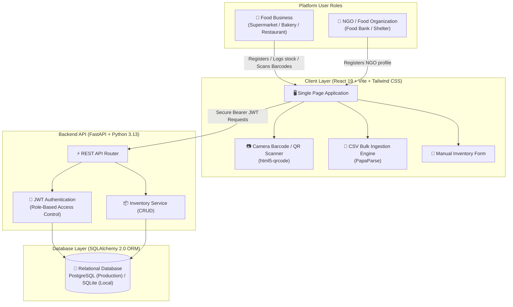
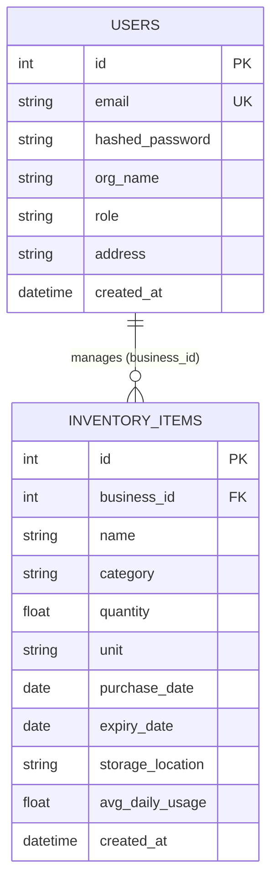

# Harvest Ledger — AI-Powered Food Waste Management Platform

[](https://github.com/preygoti/foodwaste-platform)
[](https://fastapi.tiangolo.com/)
[](https://python.org/)
[](https://www.postgresql.org/)
[](https://react.dev/)
[](https://vitejs.dev/)
[](https://tailwindcss.com/)
[](https://github.com/preygoti/foodwaste-platform)

> **Harvest Ledger** is an intelligent web platform connecting food businesses (supermarkets, restaurants, bakeries, distributors) with recipient non-profits (NGOs, food banks, community kitchens) to eliminate food waste, track batch-level shelf-life, and streamline surplus redistribution.

---

## 📊 Project Roadmap & Milestone Status

| Phase | Milestone | Focus Area | Status | Deliverables |
|---|---|---|---|---|
| **Phase 1** | **Milestone 1 (Weeks 1–2)** | **System Architecture, Database & Inventory Ingestion** | **`COMPLETED` ✅** | • Relational PostgreSQL database & SQLAlchemy ORM<br/>• Dual-role JWT authentication & RBAC<br/>• Multi-modal inventory logging (Form + Barcode Scanner + CSV)<br/>• Batch inventory CRUD REST APIs |
| **Phase 2** | **Milestone 2 (Weeks 3–4)** | **AI Waste Prediction Engine & Shelf-Life Telemetry** | **`IN PROGRESS` 🔄** | • 0–100 heuristic waste risk scoring algorithm<br/>• Smart reorder buffer calculation<br/>• Real-time shelf-life countdown trackers |
| **Phase 3** | **Milestone 3 (Weeks 5–6)** | **Surplus Marketplace & Pickup Coordination** | **`UPCOMING` 📅** | • Redistribution marketplace for NGOs<br/>• Food safety quarantine rules<br/>• 3-stage pickup request & confirmation workflow |
| **Phase 4** | **Milestone 4 (Weeks 7–8)** | **Sustainability Dashboard & Final Polish** | **`UPCOMING` 📅** | • CO₂e avoided & meals saved telemetry<br/>• Perishable category breakdown visualizations<br/>• Comprehensive documentation & final presentation |

---

## 🎯 Problem Statement

Food businesses face critical operational bottlenecks managing perishable stock:

1. **Unmonitored Shelf-Life**: Businesses track batch expiry dates across hundreds of items using manual spreadsheets or paper records, leading to unobserved expiration.
2. **Data Ingestion Friction**: Manual stock entry is time-consuming and prone to human typing errors.
3. **Lack of Role Segregation**: Organizations lack a unified digital system distinguishing donor businesses from food rescue non-profits.
4. **Data Fragmentation**: Inventory records are isolated and cannot easily feed into automated redistribution channels.

---

## 💡 Milestone 1 Implemented Features

### 1. 🗄️ Relational Database Architecture (PostgreSQL & SQLite)
- Designed with **SQLAlchemy 2.0 ORM** and Pydantic v2 data validation schemas.
- **Production**: Configured for **PostgreSQL** database connection with SSL connection pooling and auto-reconnect (`pool_pre_ping=True`).
- **Development**: Dynamic fallback to zero-configuration **SQLite** (`sqlite:///./foodwaste.db`) for offline local testing.

### 2. 🔐 Dual-Role Authentication & Security (RBAC)
- Implemented **Role-Based Access Control (RBAC)** separating:
  - **`Food Business`**: Manages inventory items, adds stock, and views shelf-life records.
  - **`NGO / Food Bank`**: Verified non-profit recipient account.
- **JWT Authorization**: Stateless JSON Web Tokens signed with secret keys.
- **Password Security**: Salted **Bcrypt** cryptographic password hashing via `passlib`.

### 3. 📦 Multi-Modal Inventory Ledger
- **Manual Data Logging**: Form capture of batch quantities, units (`kg`, `liters`, `units`, `portions`), categories, purchase dates, and storage locations.
- **📷 Camera Barcode & QR Scanner**: Integrated `html5-qrcode` library for real-time live device camera scanning of 1D product barcodes and 2D QR codes.
- **📄 Bulk CSV Ingestion**: High-performance client-side CSV parsing using `PapaParse` with validation checks and downloadable sample templates.

---

## 🏗️ System Architecture (Milestone 1)



---

## 🗄️ Relational Data Model (Milestone 1)



---

## 🛠️ Technology Stack

| Layer | Technology | Purpose |
|---|---|---|
| **Frontend Framework** | **React 19** | Component-driven Single Page Application |
| **Build Tool** | **Vite 8** | High-speed build tool and hot-module replacement |
| **Styling & Design** | **Tailwind CSS 3.4** | Modern responsive design system |
| **Routing** | **React Router v7** | Role-protected client routing |
| **Camera & Scanner** | **html5-qrcode** | Real-time device camera barcode/QR scanner |
| **CSV Engine** | **PapaParse** | Client-side CSV batch parsing & validation |
| **Icons** | **Lucide React** | Clean, lightweight SVG iconography |
| **Backend Framework** | **FastAPI 0.115** | High-performance Python async REST API |
| **Application Server** | **Uvicorn** | Production ASGI server |
| **Database & ORM** | **PostgreSQL** + **SQLAlchemy 2.0** | Relational database & ORM |
| **Data Validation** | **Pydantic v2** | Request schema validation & serialization |
| **Security & Auth** | **Python-JOSE** + **Passlib (Bcrypt)** | JWT bearer tokens & password hashing |

---

## 📂 Project Structure

```text
foodwaste-platform/
├── backend/
│   ├── auth.py                  # JWT creation, bcrypt hashing, role dependencies
│   ├── database.py              # SQLAlchemy engine & URL normalization
│   ├── main.py                  # FastAPI application & REST endpoint routers
│   ├── models.py                # Database models (User, InventoryItem)
│   ├── requirements.txt         # Python backend dependencies
│   ├── schemas.py               # Pydantic request/response schemas
│   └── test_platform_full.py    # Automated integration test suite
│
├── frontend/
│   ├── src/
│   │   ├── components/          # UI components (Scanner, CSV modal, Layout)
│   │   ├── pages/               # App pages (InventoryPage, Login, Register)
│   │   ├── api.js               # Centralized API fetch client
│   │   ├── App.jsx              # Application router
│   │   └── AuthContext.jsx      # Authentication & session state
│   ├── package.json             # Frontend dependencies & npm scripts
│   ├── tailwind.config.js       # Theme and styling configuration
│   └── vite.config.js           # Vite build configuration
│
└── README.md                    # Project documentation
```

---

## 🚀 Getting Started Locally

### Prerequisites
- **Node.js** (v18+) & **npm**
- **Python** (v3.10+)

---

### 1. Clone the Repository
```bash
git clone https://github.com/preygoti/foodwaste-platform.git
cd foodwaste-platform
```

---

### 2. Backend Setup
```bash
cd backend

# Create and activate virtual environment
python -m venv .venv
# Windows:
.venv\Scripts\activate
# macOS/Linux:
source .venv/bin/activate

# Install dependencies
pip install -r requirements.txt

# Start FastAPI server
uvicorn main:app --reload --port 8000
```
- **API Root**: `http://localhost:8000`
- **Swagger Interactive Docs**: `http://localhost:8000/docs`

---

### 3. Frontend Setup
In a new terminal window:
```bash
cd frontend

# Install packages
npm install

# Start Vite dev server
npm run dev
```
- **Web App**: `http://localhost:5173`

---

## 🧪 Automated Testing

### Backend Test Suite
```bash
cd backend
python test_platform_full.py
```

### Frontend Build Verification
```bash
cd frontend
npm run build
```

---

## 📜 License

This project is licensed under the **MIT License** — feel free to use, modify, and distribute for educational, non-profit, or commercial purposes.

---

<div align="center">
  <sub>Harvest Ledger &bull; Milestone 1 Complete &bull; Built with ❤️</sub>
</div>
